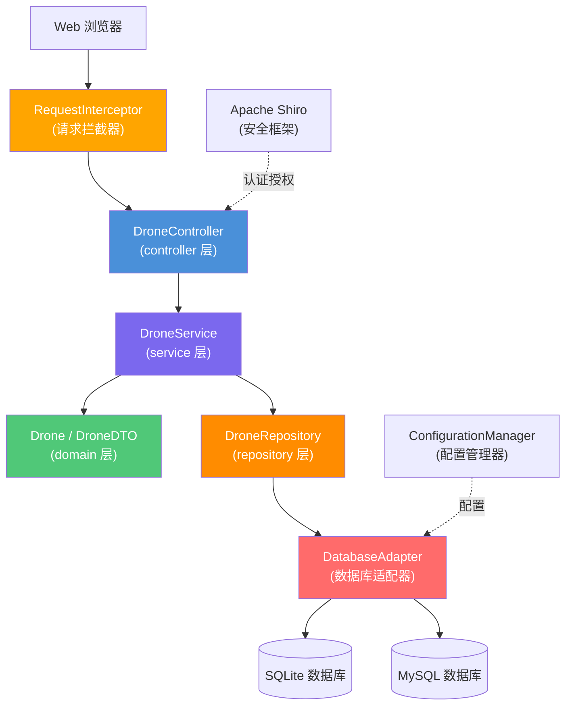

# 无人机信息管理系统技术设计文档

> **关联需求**：[requirements.md](./requirements.md)  
> **文档状态**：草稿  
> **创建时间**：2024-01-15  
> **最后更新**：2024-01-15  
> **负责人**：开发团队

---

## 概述

本设计文档描述无人机信息管理系统（Drone Management System）的技术实现方案。系统基于 Spring Boot 2.2.x + MyBatis 3.5.x 技术栈，采用标准四层架构（Controller → Service → Domain → Repository），通过适配器模式支持 SQLite 和 MySQL 数据库切换，使用 Apache Shiro 1.7 进行安全认证和授权，提供 RESTful API 和 Thymeleaf + Bootstrap 前端界面，实现无人机信息的增删改查和统一管理。

---

## 架构设计

### 组件关系图



### 数据流向

**请求处理流程**：

1. 客户端发送 HTTP 请求到系统
2. `RequestInterceptor` 拦截请求，记录请求信息（HTTP 方法、路径、参数、IP、User-Agent、时间戳）
3. Apache Shiro 进行身份认证和权限校验
4. `DroneController` 接收请求参数，执行参数校验（`@Valid`）
5. Controller 调用 `DroneService` 执行业务逻辑
6. Service 调用 `DroneRepository` 进行数据操作
7. Repository 通过 `DatabaseAdapter` 与数据库交互（根据配置选择 SQLite 或 MySQL）
8. 数据库返回结果，Repository 将结果映射为 `Drone` 实体对象
9. Service 将实体对象转换为 `DroneDTO` 响应对象
10. Controller 将响应包装为统一格式返回
11. `RequestInterceptor` 记录响应状态码和处理耗时

**异常处理流程**：

1. Service 或 Repository 抛出业务异常（`DroneNotFoundException`、`DuplicateSerialNumberException` 等）
2. 全局异常处理器（`GlobalExceptionHandler`）捕获异常
3. 返回标准错误响应格式（包含错误代码和中文错误描述）

---

## 组件和接口

### Controller 层

**DroneController**

职责：处理无人机相关的 HTTP 请求

| 方法 | 路径 | 描述 |
|------|------|------|
| `createDrone(CreateDroneRequest)` | POST `/api/v1/drones` | 创建新无人机 |
| `getDroneById(Long)` | GET `/api/v1/drones/{id}` | 根据 ID 查询无人机 |
| `listDrones(DroneQueryRequest)` | GET `/api/v1/drones` | 分页查询无人机列表 |
| `updateDrone(Long, UpdateDroneRequest)` | PUT `/api/v1/drones/{id}` | 更新无人机信息 |
| `deleteDrone(Long)` | DELETE `/api/v1/drones/{id}` | 删除无人机 |

### Service 层

**DroneService 接口**

```java
public interface DroneService {
    DroneDTO createDrone(CreateDroneRequest request);
    DroneDTO getDroneById(Long id);
    Page<DroneDTO> listDrones(DroneQueryRequest request);
    DroneDTO updateDrone(Long id, UpdateDroneRequest request);
    void deleteDrone(Long id);
}
```

**DroneServiceImpl 实现类**

职责：
- 实现无人机业务逻辑
- 验证序列号唯一性
- 执行业务规则校验
- 实体与 DTO 转换
- 事务管理

### Repository 层

**DroneRepository 接口**（MyBatis Mapper）

```java
@Mapper
public interface DroneRepository {
    int insert(Drone drone);
    Drone selectById(Long id);
    Drone selectBySerialNumber(String serialNumber);
    List<Drone> selectByConditions(DroneQueryConditions conditions);
    int countByConditions(DroneQueryConditions conditions);
    int updateById(Drone drone);
    int deleteById(Long id);
}
```

### 数据库适配器

**DatabaseAdapter 接口**

```java
public interface DatabaseAdapter {
    DataSource getDataSource();
    String getDatabaseType();
}
```

**SQLiteAdapter 实现类**

职责：配置 SQLite 数据源和连接池

**MySQLAdapter 实现类**

职责：配置 MySQL 数据源和连接池（使用 Druid）

### 拦截器

**RequestInterceptor**

职责：
- 拦截所有 HTTP 请求
- 记录请求详细信息（方法、路径、参数、IP、User-Agent、时间）
- 记录响应状态码和处理耗时
- 输出到日志系统（SLF4J + Logback）

实现方式：实现 `HandlerInterceptor` 接口

---

## 数据模型

### 实体类

**`Drone` 实体类**（对应表：`t_drone`）

| 字段名 | Java 类型 | 数据库类型 | 约束 | 说明 |
|--------|-----------|-----------|------|------|
| id | Long | BIGINT | PK, AUTO_INCREMENT | 主键 |
| serialNumber | String | VARCHAR(100) | NOT NULL, UNIQUE | 序列号 |
| modelName | String | VARCHAR(100) | NOT NULL | 型号名称 |
| manufacturer | String | VARCHAR(100) | NOT NULL | 制造商 |
| purchaseDate | LocalDate | DATE | NOT NULL | 购买日期 |
| status | DroneStatus | VARCHAR(20) | NOT NULL | 状态（枚举） |
| maxFlightTime | Integer | INT | NOT NULL | 最大飞行时间（分钟） |
| maxFlightDistance | Integer | INT | NOT NULL | 最大飞行距离（米） |
| weight | Integer | INT | NOT NULL | 重量（克） |
| remarks | String | VARCHAR(500) | NULL | 备注 |
| createdAt | LocalDateTime | DATETIME | NOT NULL | 创建时间 |
| updatedAt | LocalDateTime | DATETIME | NOT NULL | 更新时间 |

**DroneStatus 枚举**

```java
public enum DroneStatus {
    AVAILABLE("可用"),
    UNDER_MAINTENANCE("维修中"),
    SCRAPPED("已报废");
    
    private final String description;
}
```

### DTO

**`DroneDTO`（响应 DTO）**

| 字段名 | Java 类型 | 来源字段 | 说明 |
|--------|-----------|---------|------|
| id | Long | entity.id | 无人机 ID |
| serialNumber | String | entity.serialNumber | 序列号 |
| modelName | String | entity.modelName | 型号名称 |
| manufacturer | String | entity.manufacturer | 制造商 |
| purchaseDate | String | entity.purchaseDate（格式化） | 购买日期（yyyy-MM-dd） |
| status | String | entity.status.description | 状态描述 |
| maxFlightTime | Integer | entity.maxFlightTime | 最大飞行时间 |
| maxFlightDistance | Integer | entity.maxFlightDistance | 最大飞行距离 |
| weight | Integer | entity.weight | 重量 |
| remarks | String | entity.remarks | 备注 |
| createdAt | String | entity.createdAt（格式化） | 创建时间（ISO 8601） |
| updatedAt | String | entity.updatedAt（格式化） | 更新时间（ISO 8601） |

**`CreateDroneRequest`（创建请求 DTO）**

| 字段名 | Java 类型 | 校验注解 | 说明 |
|--------|-----------|---------|------|
| serialNumber | String | `@NotBlank @Size(max=100)` | 序列号 |
| modelName | String | `@NotBlank @Size(max=100)` | 型号名称 |
| manufacturer | String | `@NotBlank @Size(max=100)` | 制造商 |
| purchaseDate | String | `@NotBlank @Pattern(regexp="\\d{4}-\\d{2}-\\d{2}")` | 购买日期 |
| status | String | `@NotBlank` | 状态 |
| maxFlightTime | Integer | `@NotNull @Min(1)` | 最大飞行时间 |
| maxFlightDistance | Integer | `@NotNull @Min(1)` | 最大飞行距离 |
| weight | Integer | `@NotNull @Min(1)` | 重量 |
| remarks | String | `@Size(max=500)` | 备注（可选） |

**`UpdateDroneRequest`（更新请求 DTO）**

字段与 `CreateDroneRequest` 相同，但所有字段均为可选（用于部分更新）

**`DroneQueryRequest`（查询请求 DTO）**

| 字段名 | Java 类型 | 说明 |
|--------|-----------|------|
| modelName | String | 型号名称（模糊查询） |
| manufacturer | String | 制造商（模糊查询） |
| status | String | 状态（精确匹配） |
| pageNum | Integer | 页码（默认 1） |
| pageSize | Integer | 每页数量（默认 20） |

### 数据库表结构

**SQLite 版本**

```sql
CREATE TABLE t_drone (
    id                  INTEGER PRIMARY KEY AUTOINCREMENT,
    serial_number       TEXT NOT NULL UNIQUE,
    model_name          TEXT NOT NULL,
    manufacturer        TEXT NOT NULL,
    purchase_date       TEXT NOT NULL,
    status              TEXT NOT NULL,
    max_flight_time     INTEGER NOT NULL,
    max_flight_distance INTEGER NOT NULL,
    weight              INTEGER NOT NULL,
    remarks             TEXT,
    created_at          TEXT NOT NULL DEFAULT (datetime('now', 'localtime')),
    updated_at          TEXT NOT NULL DEFAULT (datetime('now', 'localtime'))
);

CREATE INDEX idx_serial_number ON t_drone(serial_number);
CREATE INDEX idx_model_name ON t_drone(model_name);
CREATE INDEX idx_manufacturer ON t_drone(manufacturer);
CREATE INDEX idx_status ON t_drone(status);
```

**MySQL 版本**

```sql
CREATE TABLE `t_drone` (
    `id`                  BIGINT       NOT NULL AUTO_INCREMENT COMMENT '主键',
    `serial_number`       VARCHAR(100) NOT NULL                COMMENT '序列号',
    `model_name`          VARCHAR(100) NOT NULL                COMMENT '型号名称',
    `manufacturer`        VARCHAR(100) NOT NULL                COMMENT '制造商',
    `purchase_date`       DATE         NOT NULL                COMMENT '购买日期',
    `status`              VARCHAR(20)  NOT NULL                COMMENT '状态',
    `max_flight_time`     INT          NOT NULL                COMMENT '最大飞行时间（分钟）',
    `max_flight_distance` INT          NOT NULL                COMMENT '最大飞行距离（米）',
    `weight`              INT          NOT NULL                COMMENT '重量（克）',
    `remarks`             VARCHAR(500)                         COMMENT '备注',
    `created_at`          DATETIME     NOT NULL DEFAULT CURRENT_TIMESTAMP COMMENT '创建时间',
    `updated_at`          DATETIME     NOT NULL DEFAULT CURRENT_TIMESTAMP ON UPDATE CURRENT_TIMESTAMP COMMENT '更新时间',
    PRIMARY KEY (`id`),
    UNIQUE KEY `uk_serial_number` (`serial_number`),
    INDEX `idx_model_name` (`model_name`),
    INDEX `idx_manufacturer` (`manufacturer`),
    INDEX `idx_status` (`status`)
) ENGINE=InnoDB DEFAULT CHARSET=utf8mb4 COMMENT='无人机信息表';
```

---

## 接口定义

### REST API

**基础路径**：`/api/v1/drones`

**统一响应格式**

```json
{
  "code": 200,
  "message": "success",
  "data": {}
}
```

### 接口详情：POST /api/v1/drones

**描述**：创建新无人机

**认证**：需要管理员角色

**请求体**：

```json
{
  "serialNumber": "DJI-2024-001",
  "modelName": "DJI Mavic 3",
  "manufacturer": "DJI",
  "purchaseDate": "2024-01-15",
  "status": "AVAILABLE",
  "maxFlightTime": 46,
  "maxFlightDistance": 30000,
  "weight": 895,
  "remarks": "企业版，配备 4/3 CMOS 哈苏相机"
}
```

**响应示例（201 Created）**：

```json
{
  "code": 201,
  "message": "创建成功",
  "data": {
    "id": 1,
    "serialNumber": "DJI-2024-001",
    "modelName": "DJI Mavic 3",
    "manufacturer": "DJI",
    "purchaseDate": "2024-01-15",
    "status": "可用",
    "maxFlightTime": 46,
    "maxFlightDistance": 30000,
    "weight": 895,
    "remarks": "企业版，配备 4/3 CMOS 哈苏相机",
    "createdAt": "2024-01-15T10:30:00Z",
    "updatedAt": "2024-01-15T10:30:00Z"
  }
}
```

**错误响应示例（400 Bad Request - 序列号重复）**：

```json
{
  "code": 400,
  "message": "序列号已存在",
  "data": null
}
```

**错误响应示例（400 Bad Request - 字段验证失败）**：

```json
{
  "code": 400,
  "message": "参数校验失败",
  "data": {
    "serialNumber": "序列号不能为空",
    "maxFlightTime": "最大飞行时间必须大于 0"
  }
}
```

### 接口详情：GET /api/v1/drones/{id}

**描述**：根据 ID 查询无人机详情

**认证**：需要认证（普通用户或管理员）

**请求参数**：

| 参数名 | 位置 | 类型 | 必填 | 描述 |
|--------|------|------|------|------|
| id | path | Long | 是 | 无人机唯一标识 |

**响应示例（200 OK）**：

```json
{
  "code": 200,
  "message": "success",
  "data": {
    "id": 1,
    "serialNumber": "DJI-2024-001",
    "modelName": "DJI Mavic 3",
    "manufacturer": "DJI",
    "purchaseDate": "2024-01-15",
    "status": "可用",
    "maxFlightTime": 46,
    "maxFlightDistance": 30000,
    "weight": 895,
    "remarks": "企业版，配备 4/3 CMOS 哈苏相机",
    "createdAt": "2024-01-15T10:30:00Z",
    "updatedAt": "2024-01-15T10:30:00Z"
  }
}
```

**错误响应示例（404 Not Found）**：

```json
{
  "code": 404,
  "message": "无人机不存在",
  "data": null
}
```

### 接口详情：GET /api/v1/drones

**描述**：分页查询无人机列表

**认证**：需要认证（普通用户或管理员）

**请求参数**：

| 参数名 | 位置 | 类型 | 必填 | 描述 |
|--------|------|------|------|------|
| modelName | query | String | 否 | 型号名称（模糊查询） |
| manufacturer | query | String | 否 | 制造商（模糊查询） |
| status | query | String | 否 | 状态（AVAILABLE/UNDER_MAINTENANCE/SCRAPPED） |
| pageNum | query | Integer | 否 | 页码（默认 1） |
| pageSize | query | Integer | 否 | 每页数量（默认 20） |

**响应示例（200 OK）**：

```json
{
  "code": 200,
  "message": "success",
  "data": {
    "total": 50,
    "pageNum": 1,
    "pageSize": 20,
    "pages": 3,
    "list": [
      {
        "id": 1,
        "serialNumber": "DJI-2024-001",
        "modelName": "DJI Mavic 3",
        "manufacturer": "DJI",
        "purchaseDate": "2024-01-15",
        "status": "可用",
        "maxFlightTime": 46,
        "maxFlightDistance": 30000,
        "weight": 895,
        "remarks": "企业版",
        "createdAt": "2024-01-15T10:30:00Z",
        "updatedAt": "2024-01-15T10:30:00Z"
      }
    ]
  }
}
```

### 接口详情：PUT /api/v1/drones/{id}

**描述**：更新无人机信息

**认证**：需要管理员角色

**请求参数**：

| 参数名 | 位置 | 类型 | 必填 | 描述 |
|--------|------|------|------|------|
| id | path | Long | 是 | 无人机唯一标识 |

**请求体**：

```json
{
  "status": "UNDER_MAINTENANCE",
  "remarks": "进行例行维护检查"
}
```

**响应示例（200 OK）**：

```json
{
  "code": 200,
  "message": "更新成功",
  "data": {
    "id": 1,
    "serialNumber": "DJI-2024-001",
    "modelName": "DJI Mavic 3",
    "manufacturer": "DJI",
    "purchaseDate": "2024-01-15",
    "status": "维修中",
    "maxFlightTime": 46,
    "maxFlightDistance": 30000,
    "weight": 895,
    "remarks": "进行例行维护检查",
    "createdAt": "2024-01-15T10:30:00Z",
    "updatedAt": "2024-01-15T14:20:00Z"
  }
}
```

**错误响应示例（404 Not Found）**：

```json
{
  "code": 404,
  "message": "无人机不存在",
  "data": null
}
```

**错误响应示例（400 Bad Request - 序列号重复）**：

```json
{
  "code": 400,
  "message": "序列号已存在",
  "data": null
}
```

### 接口详情：DELETE /api/v1/drones/{id}

**描述**：删除无人机

**认证**：需要管理员角色

**请求参数**：

| 参数名 | 位置 | 类型 | 必填 | 描述 |
|--------|------|------|------|------|
| id | path | Long | 是 | 无人机唯一标识 |

**响应示例（200 OK）**：

```json
{
  "code": 200,
  "message": "删除成功",
  "data": null
}
```

**错误响应示例（404 Not Found）**：

```json
{
  "code": 404,
  "message": "无人机不存在",
  "data": null
}
```

---

## 技术选型

| 技术 | 版本 | 用途 | 选择理由 |
|------|------|------|----------|
| Spring Boot | 2.2.x | 应用框架 | 项目统一技术栈，符合 Java 8 兼容性要求 |
| MyBatis | 3.5.x | 持久层框架 | 灵活的 SQL 映射，支持多数据库适配 |
| Apache Shiro | 1.7 | 安全框架 | 轻量级认证授权框架，易于集成 |
| Druid | 1.2.x | 数据库连接池 | 高性能连接池，内置监控功能 |
| Thymeleaf | 3.0.x | 视图层模板引擎 | Spring Boot 官方推荐，支持自然模板 |
| Bootstrap | 3.3.7 | 前端 UI 框架 | 成熟的响应式框架，兼容性好 |
| SQLite JDBC | 3.30+ | SQLite 驱动 | 轻量级数据库，适合小规模部署 |
| MySQL Connector | 8.0+ | MySQL 驱动 | 企业级数据库，适合大规模部署 |
| Hibernate Validation | 6.0.x | 参数校验 | JSR-303 标准实现，与 Spring Boot 集成 |
| Lombok | 1.18.x | 代码简化 | 减少样板代码（getter/setter/builder） |
| SLF4J + Logback | 1.7.x / 1.2.x | 日志框架 | Spring Boot 默认日志方案 |

---

## 错误处理

### 异常类型定义

**业务异常基类**

```java
public class DroneBusinessException extends RuntimeException {
    private final int errorCode;
    
    public DroneBusinessException(int errorCode, String message) {
        super(message);
        this.errorCode = errorCode;
    }
}
```

**具体异常类**

| 异常类 | 错误码 | 触发场景 | HTTP 状态码 |
|--------|--------|----------|-------------|
| `DroneNotFoundException` | 404 | 查询/更新/删除不存在的无人机 | 404 |
| `DuplicateSerialNumberException` | 400 | 创建/更新时序列号重复 | 400 |
| `InvalidParameterException` | 400 | 参数校验失败 | 400 |
| `DatabaseConnectionException` | 500 | 数据库连接失败 | 500 |
| `UnauthorizedException` | 401 | 未认证用户访问 | 401 |
| `ForbiddenException` | 403 | 权限不足 | 403 |

### 全局异常处理器

**GlobalExceptionHandler**

```java
@RestControllerAdvice
public class GlobalExceptionHandler {

    @ExceptionHandler(DroneNotFoundException.class)
    public ResponseEntity<ErrorResponse> handleDroneNotFound(DroneNotFoundException ex) {
        return ResponseEntity.status(404)
            .body(new ErrorResponse(404, ex.getMessage(), null));
    }

    @ExceptionHandler(DuplicateSerialNumberException.class)
    public ResponseEntity<ErrorResponse> handleDuplicateSerialNumber(DuplicateSerialNumberException ex) {
        return ResponseEntity.status(400)
            .body(new ErrorResponse(400, ex.getMessage(), null));
    }

    @ExceptionHandler(MethodArgumentNotValidException.class)
    public ResponseEntity<ErrorResponse> handleValidationException(MethodArgumentNotValidException ex) {
        Map<String, String> errors = new HashMap<>();
        ex.getBindingResult().getFieldErrors().forEach(error -> 
            errors.put(error.getField(), error.getDefaultMessage())
        );
        return ResponseEntity.status(400)
            .body(new ErrorResponse(400, "参数校验失败", errors));
    }

    @ExceptionHandler(Exception.class)
    public ResponseEntity<ErrorResponse> handleGenericException(Exception ex) {
        log.error("未处理的异常", ex);
        return ResponseEntity.status(500)
            .body(new ErrorResponse(500, "系统内部错误", null));
    }
}
```

### 错误响应格式

```java
@Data
@AllArgsConstructor
public class ErrorResponse {
    private int code;
    private String message;
    private Object data;
}
```

### 日志记录策略

| 日志级别 | 使用场景 | 示例 |
|----------|----------|------|
| DEBUG | 详细的调试信息 | 方法入参、SQL 语句 |
| INFO | 正常业务流程 | 无人机创建成功、查询操作 |
| WARN | 潜在问题 | 序列号重复尝试、参数校验失败 |
| ERROR | 错误和异常 | 数据库连接失败、未捕获异常 |

**日志格式**：

```
[时间] [级别] [线程] [类名] - [消息]
2024-01-15 10:30:00.123 INFO  [http-nio-8080-exec-1] c.e.d.s.DroneServiceImpl - 创建无人机成功，ID: 1, 序列号: DJI-2024-001
```

---

## 测试策略

### 测试分层策略

本系统采用标准的测试金字塔策略，不使用 Property-Based Testing（PBT），原因如下：

**为什么不使用 PBT**：
1. 系统主要是简单的 CRUD 操作，没有复杂的数据转换逻辑
2. 没有解析器、序列化器等需要 round-trip 测试的组件
3. 业务逻辑相对简单，主要是数据验证和持久化操作
4. 使用 example-based 单元测试和集成测试更加直接和高效

**测试策略**：
- **单元测试**：验证具体的业务逻辑和边界条件
- **集成测试**：验证数据库操作和组件协作
- **端到端测试**：验证完整的 API 流程

### 单元测试

**Service 层单元测试**

测试类：`DroneServiceImplTest`

测试框架：JUnit 5 + Mockito

覆盖场景：

| 测试方法 | 测试场景 | 验证点 |
|----------|----------|--------|
| `testCreateDrone_Success` | 正常创建无人机 | 返回包含 ID 的 DTO |
| `testCreateDrone_DuplicateSerialNumber` | 序列号重复 | 抛出 `DuplicateSerialNumberException` |
| `testGetDroneById_Success` | 查询存在的无人机 | 返回正确的 DTO |
| `testGetDroneById_NotFound` | 查询不存在的无人机 | 抛出 `DroneNotFoundException` |
| `testUpdateDrone_Success` | 正常更新无人机 | 返回更新后的 DTO |
| `testUpdateDrone_NotFound` | 更新不存在的无人机 | 抛出 `DroneNotFoundException` |
| `testUpdateDrone_DuplicateSerialNumber` | 更新时序列号重复 | 抛出 `DuplicateSerialNumberException` |
| `testDeleteDrone_Success` | 正常删除无人机 | 无异常抛出 |
| `testDeleteDrone_NotFound` | 删除不存在的无人机 | 抛出 `DroneNotFoundException` |
| `testListDrones_WithFilters` | 带条件查询 | 返回符合条件的分页结果 |
| `testListDrones_EmptyResult` | 查询无结果 | 返回空列表 |

**Controller 层切片测试**

测试类：`DroneControllerTest`

测试框架：`@WebMvcTest` + MockMvc

覆盖场景：

| 测试方法 | 测试场景 | 验证点 |
|----------|----------|--------|
| `testCreateDrone_ValidRequest` | 有效的创建请求 | 返回 201 状态码和正确的响应体 |
| `testCreateDrone_InvalidRequest` | 参数校验失败 | 返回 400 状态码和字段错误信息 |
| `testCreateDrone_MissingRequiredField` | 缺少必填字段 | 返回 400 状态码 |
| `testGetDroneById_Success` | 查询存在的无人机 | 返回 200 状态码和正确的响应体 |
| `testGetDroneById_NotFound` | 查询不存在的无人机 | 返回 404 状态码 |
| `testUpdateDrone_ValidRequest` | 有效的更新请求 | 返回 200 状态码 |
| `testDeleteDrone_Success` | 删除成功 | 返回 200 状态码 |
| `testListDrones_WithPagination` | 分页查询 | 返回正确的分页数据 |

### 集成测试

**Repository 层集成测试**

测试类：`DroneRepositoryTest`

测试框架：`@DataJpaTest` 或 `@MybatisTest`

覆盖场景：

| 测试方法 | 测试场景 | 验证点 |
|----------|----------|--------|
| `testInsert_Success` | 插入新记录 | 返回受影响行数为 1 |
| `testSelectById_Success` | 根据 ID 查询 | 返回正确的实体对象 |
| `testSelectBySerialNumber_Success` | 根据序列号查询 | 返回正确的实体对象 |
| `testSelectByConditions_WithFilters` | 条件查询 | 返回符合条件的记录列表 |
| `testUpdateById_Success` | 更新记录 | 返回受影响行数为 1 |
| `testDeleteById_Success` | 删除记录 | 返回受影响行数为 1 |

**数据库适配器集成测试**

测试类：`DatabaseAdapterTest`

覆盖场景：

| 测试方法 | 测试场景 | 验证点 |
|----------|----------|--------|
| `testSQLiteAdapter_Connection` | SQLite 连接 | 成功获取数据源 |
| `testMySQLAdapter_Connection` | MySQL 连接 | 成功获取数据源 |
| `testDatabaseSwitch_SQLiteToMySQL` | 数据库切换 | 配置切换后使用正确的数据源 |

### 端到端测试

**API 端到端测试**

测试类：`DroneApiE2ETest`

测试框架：`@SpringBootTest` + TestRestTemplate

覆盖场景：

| 测试方法 | 测试场景 | 验证点 |
|----------|----------|--------|
| `testCreateAndGetDrone` | 创建后查询 | 创建的数据可以被查询到 |
| `testUpdateDrone` | 更新流程 | 更新后数据正确变更 |
| `testDeleteDrone` | 删除流程 | 删除后无法查询到 |
| `testListDronesWithPagination` | 分页查询 | 分页数据正确 |

### 测试覆盖率要求

| 层级 | 覆盖率目标 | 说明 |
|------|-----------|------|
| Service 层 | ≥ 90% | 核心业务逻辑必须充分测试 |
| Controller 层 | ≥ 85% | 覆盖所有 API 端点和参数校验 |
| Repository 层 | ≥ 80% | 覆盖所有数据访问方法 |
| 整体覆盖率 | ≥ 80% | 符合可维护性要求 |

### 测试数据管理

**测试数据准备**：
- 使用 `@BeforeEach` 准备测试数据
- 使用 `@AfterEach` 清理测试数据
- 使用 H2 内存数据库进行单元测试和集成测试
- 使用 Testcontainers 进行真实数据库测试（可选）

**测试数据示例**：

```java
@BeforeEach
void setUp() {
    testDrone = Drone.builder()
        .serialNumber("TEST-001")
        .modelName("Test Model")
        .manufacturer("Test Manufacturer")
        .purchaseDate(LocalDate.of(2024, 1, 15))
        .status(DroneStatus.AVAILABLE)
        .maxFlightTime(30)
        .maxFlightDistance(5000)
        .weight(500)
        .remarks("Test drone")
        .build();
}
```

---

## 配置管理

### 配置文件结构

**application.yml（主配置文件）**

```yaml
spring:
  application:
    name: drone-management-system
  profiles:
    active: ${ACTIVE_PROFILE:dev}

server:
  port: 8080
  servlet:
    context-path: /

logging:
  level:
    root: INFO
    com.example.drone: DEBUG
  pattern:
    console: "%d{yyyy-MM-dd HH:mm:ss.SSS} [%thread] %-5level %logger{36} - %msg%n"
  file:
    name: logs/drone-management-system.log
    max-size: 10MB
    max-history: 30
```

**application-dev.yml（开发环境 - SQLite）**

```yaml
database:
  type: sqlite
  sqlite:
    path: ./data/drone.db

mybatis:
  mapper-locations: classpath:mapper/sqlite/*.xml
  configuration:
    map-underscore-to-camel-case: true
    log-impl: org.apache.ibatis.logging.slf4j.Slf4jImpl
```

**application-prod.yml（生产环境 - MySQL）**

```yaml
database:
  type: mysql
  mysql:
    url: jdbc:mysql://localhost:3306/drone_management?useUnicode=true&characterEncoding=utf8&useSSL=false&serverTimezone=Asia/Shanghai
    username: ${DB_USERNAME:root}
    password: ${DB_PASSWORD:password}
    driver-class-name: com.mysql.cj.jdbc.Driver

mybatis:
  mapper-locations: classpath:mapper/mysql/*.xml
  configuration:
    map-underscore-to-camel-case: true
    log-impl: org.apache.ibatis.logging.slf4j.Slf4jImpl

spring:
  datasource:
    type: com.alibaba.druid.pool.DruidDataSource
    druid:
      initial-size: 5
      min-idle: 5
      max-active: 20
      max-wait: 60000
      time-between-eviction-runs-millis: 60000
      min-evictable-idle-time-millis: 300000
      validation-query: SELECT 1
      test-while-idle: true
      test-on-borrow: false
      test-on-return: false
      pool-prepared-statements: true
      max-pool-prepared-statement-per-connection-size: 20
      filters: stat,wall,slf4j
      connection-properties: druid.stat.mergeSql=true;druid.stat.slowSqlMillis=5000
```

### 配置类设计

**DatabaseConfig**

```java
@Configuration
public class DatabaseConfig {

    @Value("${database.type}")
    private String databaseType;

    @Bean
    public DatabaseAdapter databaseAdapter() {
        if ("sqlite".equalsIgnoreCase(databaseType)) {
            return new SQLiteAdapter();
        } else if ("mysql".equalsIgnoreCase(databaseType)) {
            return new MySQLAdapter();
        } else {
            throw new IllegalArgumentException("不支持的数据库类型: " + databaseType);
        }
    }

    @Bean
    public DataSource dataSource(DatabaseAdapter adapter) {
        return adapter.getDataSource();
    }
}
```

**ShiroConfig**

```java
@Configuration
public class ShiroConfig {

    @Bean
    public SecurityManager securityManager(Realm realm) {
        DefaultWebSecurityManager securityManager = new DefaultWebSecurityManager();
        securityManager.setRealm(realm);
        return securityManager;
    }

    @Bean
    public ShiroFilterFactoryBean shiroFilter(SecurityManager securityManager) {
        ShiroFilterFactoryBean filterFactoryBean = new ShiroFilterFactoryBean();
        filterFactoryBean.setSecurityManager(securityManager);
        
        Map<String, String> filterChainDefinitionMap = new LinkedHashMap<>();
        filterChainDefinitionMap.put("/api/v1/drones/**", "authc");
        filterChainDefinitionMap.put("/**", "anon");
        
        filterFactoryBean.setFilterChainDefinitionMap(filterChainDefinitionMap);
        return filterFactoryBean;
    }
}
```

**WebMvcConfig**

```java
@Configuration
public class WebMvcConfig implements WebMvcConfigurer {

    @Autowired
    private RequestInterceptor requestInterceptor;

    @Override
    public void addInterceptors(InterceptorRegistry registry) {
        registry.addInterceptor(requestInterceptor)
                .addPathPatterns("/**")
                .excludePathPatterns("/static/**", "/error");
    }
}
```

---

## 包结构设计

```
com.example.drone/
├── config/                          # Spring 配置类
│   ├── DatabaseConfig.java          # 数据库配置
│   ├── ShiroConfig.java             # 安全配置
│   ├── WebMvcConfig.java            # Web MVC 配置
│   └── package-info.java
├── common/                          # 公共工具、常量
│   ├── constants/
│   │   └── ErrorCode.java           # 错误码常量
│   ├── utils/
│   │   └── DateUtils.java           # 日期工具类
│   └── package-info.java
├── exception/                       # 异常定义与处理
│   ├── DroneBusinessException.java  # 业务异常基类
│   ├── DroneNotFoundException.java
│   ├── DuplicateSerialNumberException.java
│   ├── GlobalExceptionHandler.java  # 全局异常处理器
│   └── package-info.java
├── interceptor/                     # 拦截器
│   ├── RequestInterceptor.java      # 请求拦截器
│   └── package-info.java
├── controller/                      # REST 控制器
│   ├── DroneController.java
│   └── package-info.java
├── service/                         # 业务逻辑
│   ├── DroneService.java            # Service 接口
│   ├── impl/
│   │   └── DroneServiceImpl.java    # Service 实现
│   └── package-info.java
├── domain/                          # 领域模型、DTO
│   ├── entity/
│   │   └── Drone.java               # 无人机实体
│   ├── dto/
│   │   ├── DroneDTO.java            # 响应 DTO
│   │   ├── CreateDroneRequest.java  # 创建请求 DTO
│   │   ├── UpdateDroneRequest.java  # 更新请求 DTO
│   │   └── DroneQueryRequest.java   # 查询请求 DTO
│   ├── enums/
│   │   └── DroneStatus.java         # 状态枚举
│   └── package-info.java
├── repository/                      # 数据访问层
│   ├── DroneRepository.java         # MyBatis Mapper 接口
│   ├── adapter/
│   │   ├── DatabaseAdapter.java     # 数据库适配器接口
│   │   ├── SQLiteAdapter.java       # SQLite 适配器
│   │   └── MySQLAdapter.java        # MySQL 适配器
│   └── package-info.java
└── DroneManagementApplication.java  # 启动类
```

**MyBatis Mapper XML 文件结构**：

```
resources/
├── mapper/
│   ├── sqlite/
│   │   └── DroneMapper.xml          # SQLite 版本 SQL
│   └── mysql/
│       └── DroneMapper.xml          # MySQL 版本 SQL
├── application.yml
├── application-dev.yml
└── application-prod.yml
```

---

## 关键技术实现

### 数据库适配器实现

**设计模式**：策略模式 + 工厂模式

**实现步骤**：

1. 定义 `DatabaseAdapter` 接口
2. 实现 `SQLiteAdapter` 和 `MySQLAdapter`
3. 在 `DatabaseConfig` 中根据配置选择适配器
4. MyBatis Mapper XML 按数据库类型分目录存放

**关键代码**：

```java
public interface DatabaseAdapter {
    DataSource getDataSource();
    String getDatabaseType();
}

@Component
@ConditionalOnProperty(name = "database.type", havingValue = "sqlite")
public class SQLiteAdapter implements DatabaseAdapter {
    
    @Value("${database.sqlite.path}")
    private String dbPath;
    
    @Override
    public DataSource getDataSource() {
        SQLiteDataSource dataSource = new SQLiteDataSource();
        dataSource.setUrl("jdbc:sqlite:" + dbPath);
        return dataSource;
    }
    
    @Override
    public String getDatabaseType() {
        return "sqlite";
    }
}

@Component
@ConditionalOnProperty(name = "database.type", havingValue = "mysql")
public class MySQLAdapter implements DatabaseAdapter {
    
    @Value("${database.mysql.url}")
    private String url;
    
    @Value("${database.mysql.username}")
    private String username;
    
    @Value("${database.mysql.password}")
    private String password;
    
    @Override
    public DataSource getDataSource() {
        DruidDataSource dataSource = new DruidDataSource();
        dataSource.setUrl(url);
        dataSource.setUsername(username);
        dataSource.setPassword(password);
        dataSource.setDriverClassName("com.mysql.cj.jdbc.Driver");
        // 配置 Druid 连接池参数
        return dataSource;
    }
    
    @Override
    public String getDatabaseType() {
        return "mysql";
    }
}
```

### 请求拦截器实现

**实现方式**：实现 `HandlerInterceptor` 接口

**关键代码**：

```java
@Component
@Slf4j
public class RequestInterceptor implements HandlerInterceptor {

    private static final String START_TIME_ATTRIBUTE = "startTime";

    @Override
    public boolean preHandle(HttpServletRequest request, HttpServletResponse response, Object handler) {
        long startTime = System.currentTimeMillis();
        request.setAttribute(START_TIME_ATTRIBUTE, startTime);
        
        log.info("请求开始 - 方法: {}, 路径: {}, 参数: {}, IP: {}, User-Agent: {}",
                request.getMethod(),
                request.getRequestURI(),
                getRequestParams(request),
                getClientIp(request),
                request.getHeader("User-Agent"));
        
        return true;
    }

    @Override
    public void afterCompletion(HttpServletRequest request, HttpServletResponse response, 
                                Object handler, Exception ex) {
        long startTime = (Long) request.getAttribute(START_TIME_ATTRIBUTE);
        long endTime = System.currentTimeMillis();
        long duration = endTime - startTime;
        
        log.info("请求结束 - 方法: {}, 路径: {}, 状态码: {}, 耗时: {}ms",
                request.getMethod(),
                request.getRequestURI(),
                response.getStatus(),
                duration);
        
        if (duration > 1000) {
            log.warn("慢请求警告 - 路径: {}, 耗时: {}ms", request.getRequestURI(), duration);
        }
    }

    private String getRequestParams(HttpServletRequest request) {
        Map<String, String[]> paramMap = request.getParameterMap();
        if (paramMap.isEmpty()) {
            return "{}";
        }
        return paramMap.entrySet().stream()
                .map(entry -> entry.getKey() + "=" + String.join(",", entry.getValue()))
                .collect(Collectors.joining("&"));
    }

    private String getClientIp(HttpServletRequest request) {
        String ip = request.getHeader("X-Forwarded-For");
        if (ip == null || ip.isEmpty() || "unknown".equalsIgnoreCase(ip)) {
            ip = request.getHeader("X-Real-IP");
        }
        if (ip == null || ip.isEmpty() || "unknown".equalsIgnoreCase(ip)) {
            ip = request.getRemoteAddr();
        }
        return ip;
    }
}
```

### 参数校验实现

**使用 Hibernate Validation 注解**：

```java
@Data
public class CreateDroneRequest {

    @NotBlank(message = "序列号不能为空")
    @Size(max = 100, message = "序列号长度不能超过 100 个字符")
    private String serialNumber;

    @NotBlank(message = "型号名称不能为空")
    @Size(max = 100, message = "型号名称长度不能超过 100 个字符")
    private String modelName;

    @NotBlank(message = "制造商不能为空")
    @Size(max = 100, message = "制造商长度不能超过 100 个字符")
    private String manufacturer;

    @NotBlank(message = "购买日期不能为空")
    @Pattern(regexp = "\\d{4}-\\d{2}-\\d{2}", message = "购买日期格式必须为 yyyy-MM-dd")
    private String purchaseDate;

    @NotBlank(message = "状态不能为空")
    private String status;

    @NotNull(message = "最大飞行时间不能为空")
    @Min(value = 1, message = "最大飞行时间必须大于 0")
    private Integer maxFlightTime;

    @NotNull(message = "最大飞行距离不能为空")
    @Min(value = 1, message = "最大飞行距离必须大于 0")
    private Integer maxFlightDistance;

    @NotNull(message = "重量不能为空")
    @Min(value = 1, message = "重量必须大于 0")
    private Integer weight;

    @Size(max = 500, message = "备注长度不能超过 500 个字符")
    private String remarks;
}
```

**Controller 中启用校验**：

```java
@PostMapping
public ResponseEntity<ApiResponse<DroneDTO>> createDrone(@Valid @RequestBody CreateDroneRequest request) {
    DroneDTO drone = droneService.createDrone(request);
    return ResponseEntity.status(201)
            .body(new ApiResponse<>(201, "创建成功", drone));
}
```

---

## 风险与注意事项

### 技术风险

| 风险 | 影响程度 | 概率 | 应对策略 |
|------|----------|------|----------|
| SQLite 并发写入性能瓶颈 | 中 | 中 | 文档说明 SQLite 适用于小规模部署（<50 并发），推荐生产环境使用 MySQL |
| 数据库切换时 SQL 语法差异 | 中 | 高 | 为每种数据库维护独立的 Mapper XML 文件，充分测试 |
| Shiro 配置复杂度 | 低 | 中 | 提供详细的配置文档和示例代码 |
| 日志文件过大 | 低 | 中 | 配置日志滚动策略（按日期和大小） |

### 注意事项

1. **数据库初始化**：
   - SQLite：首次启动时自动创建数据库文件和表结构
   - MySQL：需要手动创建数据库，表结构通过 Flyway 或 Liquibase 管理

2. **并发安全**：
   - 序列号唯一性校验：在数据库层面添加唯一索引，避免并发插入重复数据
   - 使用乐观锁或悲观锁处理并发更新（如需要）

3. **事务边界**：
   - Service 层方法添加 `@Transactional` 注解
   - 事务传播行为使用默认的 `REQUIRED`
   - 只读操作使用 `@Transactional(readOnly = true)` 优化性能

4. **性能优化**：
   - 为常用查询字段（序列号、型号、制造商、状态）添加索引
   - 分页查询使用 MyBatis PageHelper 插件
   - 考虑添加 Redis 缓存热点数据（后续迭代）

5. **安全加固**：
   - 生产环境必须修改默认密码
   - 启用 HTTPS（通过反向代理如 Nginx）
   - 定期更新依赖库版本，修复安全漏洞

6. **日志脱敏**：
   - 避免在日志中输出敏感信息（密码、Token）
   - 对用户输入进行脱敏处理后再记录

---

## 变更记录

| 版本 | 日期 | 变更内容 | 变更人 |
|------|------|----------|--------|
| v1.0 | 2024-01-15 | 初始版本 | 开发团队 |
